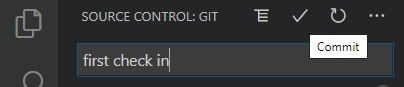

## Using github with R project

I first create a git repository and clone it to local disk

`git clone clone https://github.com/sspak9/Rgit.git`

There will be a folder created call Rgit with the following content
```
.git
LICNESE
README.md
```

I can either start saving R stuff here or I can create a new folder somewhere and at least copy the .git folder and/or other to that folder.  In my case I created a new folder `rprj` where I copied the above

Then, I create a new R project and use "existing directory" to point to my `rprj` and create a new R project file called `First.R` with the following content:

```R
library(nycflights13)
library(ggplot2)
library(dplyr)

alaska_flights <- flights %>% 
  filter(carrier == "AS")

ggplot(data = alaska_flights, mapping = aes(x = dep_delay, y = arr_delay)) + 
  geom_point()
```

Because I use VS code for other development projects, my personal preference is to use VS Code with git integration to check what got changed between the local copy and the github copy, BEFORE checking into github.
```
M means modified
U means new item (untracked)
```


When done with initial coding, I check in using the VS Code and select "Push" menu from the 3 dot menu



When you go and check the repository: `https://github.com/sspak9/Rgit` you see that the files have been checked in:


After you work on few updates, verify if you wish to "save" the changes


If all good, you would check in or discard the changes if you do not wish to check in, you can discard the changes


And this is how the github dashboard looks


